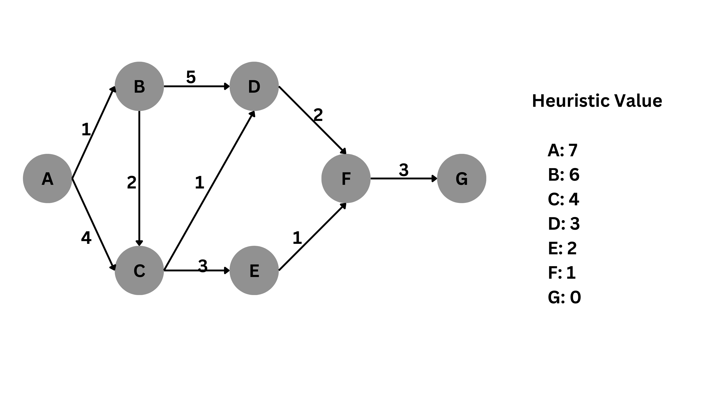

Perhatikan gambar berikut

Tugas:
1. Silahkan Clone repo ini dan isi code anda di main.py dengan memasukkan graph dan nilai heuristicnya
2. lakukan pytest
3. jika seluruh rangkaian test sukses, silahkan push dengan cara
    - git add .
    - git commit -m "Nama - NIM"
    - git push origin main